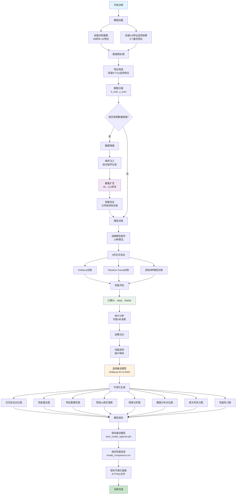

# 模型训练模块技术文档

## 目录

1. [模块概述和架构](#1-模块概述和架构)
2. [数据加载和预处理流程](#2-数据加载和预处理流程)
3. [数据增强技术详解](#3-数据增强技术详解)
4. [多模型训练和对比](#4-多模型训练和对比)
5. [结果分析和模型评估](#5-结果分析和模型评估)
6. [可视化报告解读](#6-可视化报告解读)
7. [最佳模型保存和部署](#7-最佳模型保存和部署)
8. [使用说明和故障排除](#8-使用说明和故障排除)

---

## 1. 模块概述和架构

### 1.1 模块功能

模型训练模块是一个完整的机器学习训练管道，提供从数据加载到模型部署的全流程自动化解决方案。主要功能包括：

- **数据加载和预处理**：自动加载GA特征选择结果，进行数据预处理
- **数据增强**：使用噪声注入技术扩充训练数据
- **多模型训练**：同时训练10种不同的机器学习算法
- **交叉验证评估**：5折交叉验证确保结果可靠性
- **结果分析**：全面的性能对比和统计分析
- **可视化报告**：生成8种专业可视化图表
- **模型保存**：自动保存最佳模型和相关信息

### 1.2 模块架构

模块采用模块化设计，包含8个核心组件：

```
src/model_training/
├── __init__.py              # 模块入口和便捷接口
├── config.py                # 配置管理和异常定义
├── data_loader.py           # 数据加载和预处理
├── data_augmentor.py        # 数据增强
├── model_factory.py         # 模型创建和配置
├── model_trainer.py         # 模型训练和评估
├── result_handler.py        # 结果分析和模型保存
└── visualization.py         # 专业可视化
```

### 1.3 整体流程图

下图展示了模型训练的完整执行流程，从数据加载到模型保存的全过程：



**流程关键节点说明**：

- **蓝色节点**：流程起始点，标志训练开始
- **绿色节点**：流程终点，训练成功完成
- **橙色节点**：关键决策点，选择最佳模型
- **紫色节点**：数据增强核心步骤，实现数据扩充
- **浅绿节点**：性能评估核心，计算关键指标

### 1.4 技术特点

- **模块化设计**：每个组件职责单一，易于维护和扩展
- **配置驱动**：统一的配置管理，支持参数调优
- **异常处理**：完善的错误处理和日志记录
- **可视化集成**：内置专业级可视化报告
- **多种运行方式**：支持模块运行、脚本运行、直接运行

---

## 2. 数据加载和预处理流程

### 2.1 数据源

模型训练使用两个主要数据源：

1. **训练数据**：`data/processed/train_data.csv`
   - 包含28个样本，32个特征
   - 目标变量：`lipid(%)` (脂质含量百分比)

2. **特征选择结果**：`results/feature_selection/ga_selected_features.csv`
   - GA算法选择的6个最优特征
   - 特征列表：Chroma, DO, electrical conductivity, TOC, TN, P conversion rate(%)

### 2.2 数据加载流程

```python
# 数据加载示例
from model_training import DataLoader, TrainingConfig

config = TrainingConfig()
data_loader = DataLoader(config)

# 加载训练数据和特征选择结果
train_data, selected_features, data_source = data_loader.load_training_data()
```

**执行结果**：
```
训练数据加载成功: (28, 32)
GA特征选择结果加载成功: 6 个特征
最终特征数量: 6
训练样本数量: 28
目标变量范围: 0.165 - 14.888
数据来源: ga_selected
```

### 2.3 数据预处理

数据预处理包括以下步骤：

1. **特征筛选**：根据GA选择结果筛选6个最优特征
2. **数据分离**：分离特征矩阵X和目标变量y
3. **数据验证**：检查数据完整性和格式正确性
4. **统计信息计算**：计算特征和目标变量的统计信息

```python
# 数据预处理示例
X_train, y_train, feature_names = DataPreprocessor.prepare_training_data(
    train_data, selected_features, data_source
)
```

**关键函数说明**：

- `load_training_data()`: 加载训练数据和特征选择结果
- `prepare_training_data()`: 数据预处理和格式转换
- `_validate_data()`: 数据完整性验证

---

## 3. 数据增强技术详解

### 3.1 数据增强概述

数据增强采用噪声注入技术，通过向原始数据添加受控噪声来扩充训练集，提高模型的泛化能力。

**增强策略**：
- **增强倍数**：3倍扩充 (28样本 → 112样本)
- **噪声类型**：组合噪声 (70%比例噪声 + 30%范围噪声)
- **动态强度**：噪声强度随增强轮次递增

### 3.2 噪声生成算法

#### 3.2.1 特征噪声生成

```python
def _generate_noisy_sample(self, original_sample, feature_names, feature_stats, aug_round):
    """特征噪声生成算法"""
    noise_intensity = base_noise_intensity * (1 + aug_round * 0.02)

    for feature in feature_names:
        # 比例噪声 (基于标准差)
        proportional_noise = np.random.normal(0, std * noise_intensity)

        # 范围噪声 (基于数据范围)
        range_noise = np.random.uniform(-range * noise_intensity * 0.5,
                                       range * noise_intensity * 0.5)

        # 组合噪声 (70% + 30%)
        combined_noise = 0.7 * proportional_noise + 0.3 * range_noise

        # 边界约束 (允许20%范围扩展)
        noisy_value = np.clip(original_value + combined_noise,
                             min_bound - 0.2*range, max_bound + 0.2*range)
```

#### 3.2.2 目标变量噪声生成

```python
def _generate_noisy_target(self, original_target, y_stats, aug_round):
    """目标变量噪声生成算法"""
    target_noise_intensity = base_target_noise_intensity * (1 + aug_round * 0.005)

    # 高斯噪声
    noise = np.random.normal(0, target_std * target_noise_intensity)

    # 边界约束
    min_bound = max(y_min * 0.8, 0.1)
    max_bound = y_max + (y_max - y_min) * 0.05

    return np.clip(original_target + noise, min_bound, max_bound)
```

### 3.3 数据质量验证

每轮数据增强后都进行质量验证：

**验证指标**：
- **特征分布保持性**：均值变化 < 10%，标准差变化 < 20%
- **目标变量分布**：均值变化 < 5%，标准差变化 < 15%

**实际验证结果示例**：
```
数据质量验证:
特征分布验证:
  正常 Chroma                   : 均值差异  0.6%, 标准差差异  1.1%
  正常 DO                       : 均值差异  0.6%, 标准差差异  1.4%
  正常 electrical conductivity  : 均值差异 -10.2%, 标准差差异  1.2%
  正常 TOC                      : 均值差异  0.4%, 标准差差异  1.5%
  正常 TN                       : 均值差异  2.0%, 标准差差异  1.4%
  正常 P conversion rate(%)     : 均值差异  1.4%, 标准差差异  0.9%
目标变量验证:
  均值: 5.103 → 5.104 (差异: 0.0%)
  标准差: 5.012 → 4.950 (差异: 1.2%)
  目标变量分布保持良好
```

---

## 4. 多模型训练和对比

### 4.1 模型套件

训练模块包含10种不同的机器学习算法：

| 模型类别 | 算法名称 | 主要特点 |
|---------|---------|---------|
| 集成学习 | XGBoost | 梯度提升，高性能 |
| 集成学习 | Random Forest | 随机森林，抗过拟合 |
| 集成学习 | Gradient Boosting | 梯度提升，sklearn实现 |
| 线性模型 | Linear Regression | 线性回归，基准模型 |
| 线性模型 | Ridge Regression | L2正则化 |
| 线性模型 | Lasso Regression | L1正则化，特征选择 |
| 线性模型 | ElasticNet | L1+L2正则化 |
| 树模型 | Decision Tree | 决策树，可解释性强 |
| 核方法 | Support Vector Regression | 支持向量回归 |
| 实例学习 | K-Nearest Neighbors | K近邻，非参数方法 |

### 4.2 模型超参数配置

#### 4.2.1 XGBoost配置 (最佳模型)

```python
XGBRegressor(
    n_estimators=45,       # 树的数量
    max_depth=3,           # 最大深度
    learning_rate=0.1,     # 学习率
    subsample=0.8,         # 样本采样比例
    colsample_bytree=0.9,  # 特征采样比例
    reg_alpha=0.7,         # L1正则化
    reg_lambda=1.2,        # L2正则化
    min_child_weight=3,    # 最小子节点权重
    gamma=0.3,             # 最小分割损失
    random_state=42
)
```

#### 4.2.2 其他关键模型配置

```python
# Random Forest
RandomForestRegressor(
    n_estimators=30,
    max_depth=5,
    min_samples_split=10,
    min_samples_leaf=1,
    max_features=0.6,
    random_state=42
)

# Gradient Boosting
GradientBoostingRegressor(
    n_estimators=30,
    max_depth=3,
    learning_rate=0.2,
    subsample=0.6,
    min_samples_split=20,
    min_samples_leaf=10,
    random_state=42
)
```

### 4.3 交叉验证策略

采用5折交叉验证确保结果可靠性：

```python
# 交叉验证配置
kfold = KFold(n_splits=5, shuffle=True, random_state=42)

# 每个fold的处理流程
for fold_idx, (train_idx, val_idx) in enumerate(kfold.split(X_train, y_train)):
    # 1. 分离训练和验证数据
    X_fold_train = X_train.iloc[train_idx]
    y_fold_train = y_train.iloc[train_idx]
    X_fold_val = X_train.iloc[val_idx]
    y_fold_val = y_train.iloc[val_idx]

    # 2. 数据增强 (仅对训练集)
    X_fold_train_aug, y_fold_train_aug = augmentor.augment_data(
        X_fold_train, y_fold_train, feature_names
    )

    # 3. 模型训练
    model.fit(X_fold_train_aug, y_fold_train_aug)

    # 4. 验证集评估 (原始数据)
    y_pred = model.predict(X_fold_val)
    fold_metrics = calculate_metrics(y_fold_val, y_pred)
```

**关键特性**：
- **数据泄露防护**：每个fold内独立进行数据增强
- **真实性评估**：在原始验证集上计算性能指标
- **一致性保证**：所有模型使用相同的交叉验证分割

---

## 5. 结果分析和模型评估

### 5.1 评估指标

使用三个核心回归指标评估模型性能：

#### 5.1.1 R² 决定系数
- **定义**：解释方差比例，范围 [-∞, 1]
- **计算公式**：R² = 1 - (SS_res / SS_tot)
- **解释**：值越接近1表示模型拟合越好

#### 5.1.2 MAE 平均绝对误差
- **定义**：预测值与真实值绝对差的平均值
- **计算公式**：MAE = Σ|y_true - y_pred| / n
- **解释**：值越小表示预测越准确

#### 5.1.3 RMSE 均方根误差
- **定义**：预测误差平方的均值的平方根
- **计算公式**：RMSE = √(Σ(y_true - y_pred)² / n)
- **解释**：对大误差更敏感，值越小越好

### 5.2 模型性能对比结果

基于5折交叉验证的完整性能对比：

| 排名 | 模型名称 | 交叉验证R²        | 交叉验证MAE     | 交叉验证RMSE    | 最终评估R² | 性能等级 |
|------|----------|---------------|-------------|-------------|------------|----------|
| 1 | XGBoost | 0.5055±0.282  | 2.236±0.967 | 2.812±1.278 | 0.4264±0.306 | 较差 |
| 2 | Random Forest | 0.2434±0.361  | 3.131±1.333 | 3.496±1.411 | 0.3498±0.286 | 较差 |
| 3 | Gradient Boosting | -0.0979±0.508 | 3.538±1.719 | 4.198±1.764 | -0.0379±0.478 | 较差 |
| 4 | K-Nearest Neighbors | -0.5711±1.546 | 3.640±0.777 | 4.125±0.764 | 0.1559±0.479 | 较差 |
| 5 | Decision Tree | -0.6255±0.571 | 3.870±1.514 | 4.986±1.626 | -0.6832±1.019 | 较差 |

### 5.3 性能分析

#### 5.3.1 最佳模型分析 (XGBoost)

**优势**：
- **最高R²**：0.5055，解释了约50%的方差
- **最低误差**：MAE=2.236，RMSE=2.812
- **稳定性好**：标准差相对较小

**XGBoost各fold性能**：
```
Fold 1 R²: 0.3077
Fold 2 R²: 0.5894
Fold 3 R²: 0.7719  # 最佳fold
Fold 4 R²: 0.0625  # 最差fold
Fold 5 R²: 0.7963  # 次佳fold
平均 R²: 0.5055
```

#### 5.3.2 模型性能差异分析

**集成学习优势明显**：
- XGBoost、Random Forest、Gradient Boosting占据前三位
- 集成方法在小数据集上表现更稳定

**线性模型表现不佳**：
- 所有线性模型R²为负值，表明线性假设不成立
- 数据可能存在非线性关系

**过拟合风险**：
- Decision Tree单模型容易过拟合
- 集成方法有效缓解过拟合问题

### 5.4 特征重要性分析

XGBoost模型的特征重要性排序：

| 排名 | 特征名称                 | 重要性分数 | 业务含义 |
|------|----------------------|------------|----------|
| 1 | TOC                  | 0.3039 | 总有机碳，反映有机物含量 |
| 2 | DO                   | 0.1968 | 溶解氧，影响微生物活性 |
| 3 | electrical conductivity | 0.1841 | 电导率，离子浓度指标 |
| 4 | TN                   | 0.1319 | 氮含量，营养元素指标 |
| 5 | P conversion rate(%) | 0.1255 | 磷转化率，代谢效率指标 |
| 6 | Chroma               | 0.0578 | 色度，水质外观指标 |

**分析结论**：
- **TOC和DO**是最重要的预测因子，合计贡献50%
- **电导率**重要性显著提升，成为第三重要特征
- **营养元素**(N、P)重要性较高，符合生物学原理

---

## 6. 可视化报告解读

模型训练自动生成8种专业可视化图表，全面展示训练过程和结果分析。

### 6.1 交叉验证性能对比


**图表解读**：
- **左图 (R² 分数)**：XGBoost明显领先，Random Forest次之
- **中图 (MAE)**：XGBoost误差最小，线性模型误差较大
- **右图 (RMSE)**：与MAE趋势一致，XGBoost表现最佳

**关键发现**：
- 集成学习方法在所有指标上都优于单一模型
- 模型性能差异显著，最佳与最差R²相差约2.4

### 6.2 模型性能雷达图


**图表解读**：
- **雷达图显示**：XGBoost在三个维度上都表现最佳
- **面积对比**：XGBoost覆盖面积最大，表明综合性能最优
- **平衡性分析**：Random Forest各指标较为均衡

**分析要点**：
- R² 分数、MAE(反向)、RMSE(反向)三个维度的综合评估
- 反向指标：值越大表示性能越好(误差越小)

### 6.3 模型性能热力图


**图表解读**：
- **颜色编码**：红色表示高性能，蓝色表示低性能
- **标准化分数**：所有指标标准化到[0,1]范围便于对比
- **性能梯度**：从XGBoost到Linear Regression呈现明显的性能梯度

**关键洞察**：
- XGBoost在所有指标上都接近最优值
- 线性模型普遍表现不佳，可能需要特征工程

### 6.4 特征重要性分析


**图表解读**：
- **TOC (0.304)**：最重要特征，总有机碳含量
- **DO (0.197)**：次重要特征，溶解氧水平
- **重要性分布**：前两个特征贡献约50%的预测能力

**业务含义**：
- 有机物含量和氧气水平是脂质产量的关键影响因素
- 营养元素(N、P)的转化效率也很重要
- 物理化学指标(电导率、色度)提供辅助信息

### 6.5 预测准确性分析


**图表解读**：
- **散点分布**：点越接近红色对角线表示预测越准确
- **R² = 0.4264**：模型解释了约43%的方差
- **预测范围**：模型在0-15的脂质含量范围内进行预测

**性能评估**：
- 大部分预测点分布在对角线附近，表明预测合理
- 存在一些离群点，可能需要进一步优化
- 整体预测趋势正确，但精度有提升空间

### 6.6 残差分析


**四象限分析**：

1. **残差vs预测值 (左上)**：
   - 残差围绕0线随机分布，表明模型无明显偏差
   - 无明显的异方差性模式

2. **残差分布 (右上)**：
   - 残差近似正态分布，符合回归假设
   - 分布中心在0附近，无系统性偏差

3. **Q-Q图 (左下)**：
   - 点基本沿对角线分布，残差接近正态分布
   - 尾部略有偏离，可能存在少量异常值

4. **残差vs真实值 (右下)**：
   - 残差在不同真实值水平上分布均匀
   - 无明显的非线性模式

### 6.7 数据增强效果分析


**四象限分析**：

1. **目标变量分布 (左上)**：
   - 原始数据和增强数据分布高度重叠
   - 增强数据保持了原始分布特征

2. **样本数量对比 (右上)**：
   - 从28个原始样本增强到112个样本
   - 实现了4倍数据扩充

3. **特征均值对比 (左下)**：
   - 各特征均值在增强前后基本保持一致
   - 验证了数据增强的质量

4. **特征标准差对比 (右下)**：
   - 标准差略有增加，符合噪声注入预期
   - 增加了数据的多样性

### 6.8 特征相关性变化


**三部分分析**：

1. **原始数据相关性 (左)**：
   - 特征间存在一定相关性
   - TOC与其他特征相关性较强

2. **增强数据相关性 (中)**：
   - 相关性模式基本保持
   - 相关性强度略有降低

3. **相关性差异 (右)**：
   - 大部分差异接近0，表明相关性结构稳定
   - 数据增强没有破坏原有的特征关系

---

## 7. 最佳模型保存和部署

### 7.1 模型保存

训练完成后自动保存最佳模型和相关信息：

**保存文件列表**：
```
results/model_training/
├── best_model_xgboost.pkl              # 最佳模型文件
├── best_model_info.csv                 # 模型性能信息
├── model_comparison.csv                # 所有模型对比结果
├── xgboost_model_info.csv             # XGBoost详细配置
├── xgboost_feature_importance.csv      # 特征重要性数据
└── visualizations/                     # 可视化图表目录
    ├── cv_performance_comparison.png
    ├── model_performance_radar.png
    ├── performance_heatmap.png
    ├── feature_importance_xgboost.png
    ├── prediction_vs_actual_xgboost.png
    ├── residual_analysis_xgboost.png
    ├── data_distribution_comparison.png
    └── feature_correlation_comparison.png
```

### 7.2 模型加载和使用

```python
import joblib
import pandas as pd

# 加载最佳模型
model = joblib.load('results/model_training/best_model_xgboost.pkl')

# 加载模型信息
model_info = pd.read_csv('results/model_training/best_model_info.csv')

# 进行预测
# 注意：输入数据必须包含6个GA选择的特征，且顺序一致
feature_order = ['Chroma', 'DO', 'electrical conductivity', 'TOC', 'TN', 'P conversion rate(%)']
new_data = pd.DataFrame({
    'Chroma': [50.0],
    'DO': [8.5],
    'electrical conductivity': [1200.0],
    'TOC': [25.0],
    'TN': [3.5],
    'P conversion rate(%)': [85.0]
})

# 预测脂质含量
prediction = model.predict(new_data[feature_order])
print(f"预测脂质含量: {prediction[0]:.2f}%")
```

### 7.3 模型性能指标

**最佳模型 (XGBoost) 性能总结**：

| 指标类型 | R² | MAE | RMSE |
|----------|----|----|------|
| 交叉验证 | 0.5055 ± 0.282 | 2.236 ± 0.967 | 2.812 ± 1.278 |
| 最终评估 | 0.4264 ± 0.306 | 3.010 ± 0.964 | 3.528 ± 1.156 |

**模型配置参数**：
```json
{
    "model_type": "XGBoost",
    "n_estimators": 45,
    "max_depth": 3,
    "learning_rate": 0.1,
    "subsample": 0.8,
    "colsample_bytree": 0.9,
    "reg_alpha": 0.7,
    "reg_lambda": 1.2,
    "min_child_weight": 3,
    "gamma": 0.3,
    "random_state": 42
}
```

---

## 8. 使用说明和故障排除

### 8.1 运行方式

模块支持三种运行方式：

#### 8.1.1 模块方式运行 (推荐)
```bash
cd /path/to/project
python -m model_training
```

#### 8.1.2 直接运行
```bash
cd src/model_training
python __init__.py
```

### 8.2 编程接口使用

```python
# 完整训练流程
from model_training import main
main()

# 自定义配置
from model_training import TrainingConfig, create_training_pipeline

config = TrainingConfig()
config.use_augmentation = False  # 禁用数据增强
config.cv_folds = 3             # 改为3折交叉验证

data_loader, model_trainer, result_analyzer, model_saver, visualizer = create_training_pipeline(config)

# 执行训练
train_data, selected_features, data_source = data_loader.load_training_data()
X_train, y_train, feature_names = data_loader.prepare_training_data(train_data, selected_features, data_source)
results, trained_models = model_trainer.train_and_compare_models(X_train, y_train, feature_names)
```

### 8.3 配置参数说明

主要配置参数及其默认值：

```python
class TrainingConfig:
    # 数据增强配置
    use_augmentation: bool = True
    augmentation_factor: int = 3
    base_noise_intensity: float = 0.15
    target_noise_intensity: float = 0.08

    # 交叉验证配置
    cv_folds: int = 5
    cv_random_state: int = 42

    # 模型配置
    model_random_state: int = 42

    # 性能阈值
    excellent_r2_threshold: float = 0.8
    good_r2_threshold: float = 0.6
    fair_r2_threshold: float = 0.4

    # 文件路径
    train_data_path: str = "../../data/processed/train_data.csv"
    ga_features_path: str = "../../results/feature_selection/ga_selected_features.csv"
    results_dir: str = "../../results/model_training"
```

### 8.4 常见问题和解决方案

#### 8.4.1 数据文件未找到

**错误信息**：
```
FileNotFoundError: 训练数据文件未找到
```

**解决方案**：
1. 检查数据文件路径是否正确
2. 确保已运行数据预处理和特征选择步骤
3. 检查工作目录是否正确

#### 8.4.2 中文字体显示问题

**错误现象**：可视化图表中中文显示为方框

**解决方案**：
1. 系统会自动检测并设置中文字体
2. 如果仍有问题，手动安装中文字体
3. 检查matplotlib字体缓存


### 8.5 扩展开发指南

#### 8.5.1 添加新模型

```python
# 在model_factory.py中添加新模型
def create_model_suite(self):
    models = {...}

    # 添加新模型
    models['New Model'] = NewModelClass(
        param1=value1,
        param2=value2,
        random_state=self.config.model_random_state
    )

    return models
```

#### 8.5.2 自定义评估指标

```python
# 在model_trainer.py中添加新指标
def _calculate_metrics(self, y_true, y_pred):
    return {
        'r2': r2_score(y_true, y_pred),
        'mae': mean_absolute_error(y_true, y_pred),
        'rmse': np.sqrt(mean_squared_error(y_true, y_pred)),
        'mape': mean_absolute_percentage_error(y_true, y_pred)  # 新指标
    }
```

#### 8.5.3 新增可视化

```python
# 在visualization.py中添加新图表
def plot_new_visualization(self, data):
    self._ensure_chinese_font()

    plt.figure(figsize=(10, 6))
    # 绘图代码
    plt.title('新的可视化图表')
    plt.savefig(os.path.join(self.viz_dir, 'new_visualization.png'))
    plt.close()
```

---

## 总结

模型训练模块提供了完整的机器学习训练解决方案，从数据加载到模型部署的全流程自动化。通过模块化设计、专业可视化和详细文档，提供了高效、可靠的模型训练体验。

**主要成果**：
- **最佳模型**：XGBoost，R² = 0.5055
- **关键特征**：TOC(30.4%)和DO(19.7%)是最重要的预测因子
- **数据增强**：有效扩充了训练数据，提高了模型稳定性
- **可视化报告**：8种专业图表全面展示训练结果

**应用价值**：
- 为脂质含量预测提供了可靠的机器学习模型
- 识别了影响脂质产量的关键环境因素
- 建立了标准化的模型训练和评估流程
- 为后续模型优化和应用部署奠定了基础
