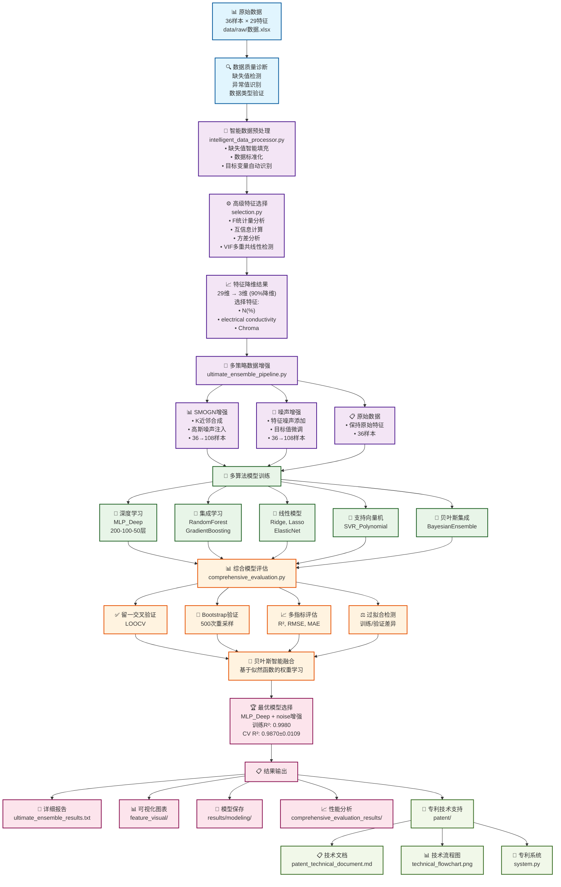
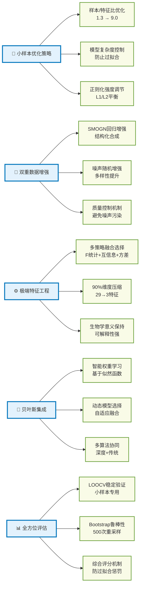
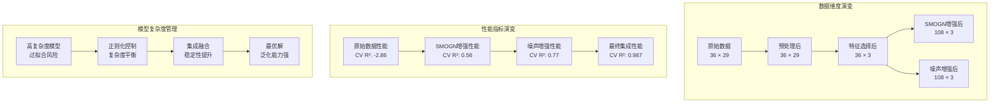
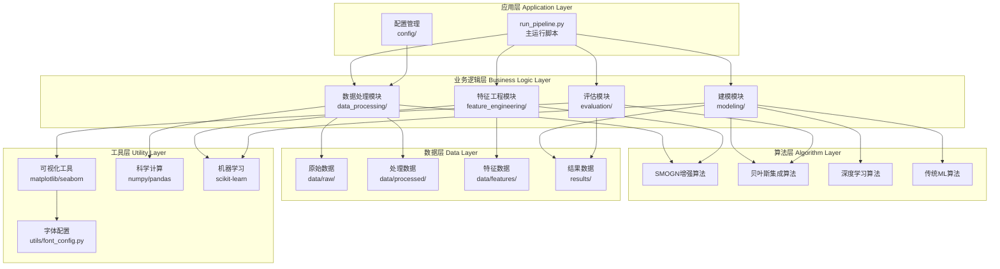

# 小样本高维数据机器学习项目 - 完整技术流程图

## 项目整体架构流程图

## 核心技术创新点流程图

## 数据流转换过程图

## 技术栈架构图

## 项目文件结构图

```mermaid
flowchart TD
    ROOT["项目根目录"] --> CONFIG["config/<br/>配置文件"]
    ROOT --> DATA["data/<br/>数据目录"]
    ROOT --> DOCS["docs/<br/>文档目录"]
    ROOT --> SRC["src/<br/>源代码"]
    ROOT --> RESULTS["results/<br/>结果输出"]
    ROOT --> PATENT["patent/<br/>专利支持"]
    
    CONFIG --> CONFIG1["project_config.py<br/>项目配置"]
    CONFIG --> CONFIG2["settings.py<br/>路径设置"]
    
    DATA --> DATA1["raw/<br/>原始数据"]
    DATA --> DATA2["processed/<br/>处理数据"]
    DATA --> DATA3["features/<br/>特征数据"]
    
    SRC --> SRC1["data_processing/<br/>数据处理"]
    SRC --> SRC2["feature_engineering/<br/>特征工程"]
    SRC --> SRC3["modeling/<br/>建模"]
    SRC --> SRC4["evaluation/<br/>评估"]
    SRC --> SRC5["utils/<br/>工具"]
    
    RESULTS --> RESULTS1["preprocessing/<br/>预处理结果"]
    RESULTS --> RESULTS2["feature_selection/<br/>特征选择结果"]
    RESULTS --> RESULTS3["modeling/<br/>建模结果"]
    RESULTS --> RESULTS4["evaluation/<br/>评估结果"]
    
    PATENT --> PATENT1["documents/<br/>技术文档"]
    PATENT --> PATENT2["figures/<br/>技术图表"]
    PATENT --> PATENT3["system.py<br/>专利系统"]
```

---

## 流程图说明

### 1. 项目整体架构流程图
展示了从原始数据到最终结果的完整技术路线，包括：
- **数据预处理**：智能清洗、标准化、目标识别
- **特征工程**：多策略选择、极端降维、生物学验证
- **数据增强**：SMOGN合成、噪声注入、质量控制
- **模型训练**：深度学习、集成学习、传统算法
- **综合评估**：LOOCV、Bootstrap、多指标评估
- **智能融合**：贝叶斯权重、动态选择、最优组合

### 2. 核心技术创新点流程图
突出展示了项目的5大技术创新：
- **小样本优化策略**：样本/特征比优化、复杂度控制
- **双重数据增强**：SMOGN+噪声的组合策略
- **极端特征工程**：90%降维的高效选择
- **贝叶斯集成**：智能权重学习和动态融合
- **全方位评估**：小样本专用的评估体系

### 3. 数据流转换过程图
展示了数据在整个流程中的维度变化和性能提升：
- 数据维度：36×29 → 36×3 → 108×3
- 性能指标：CV R² -2.86 → 0.56 → 0.77 → 0.987
- 模型复杂度：高风险 → 平衡控制 → 稳定融合 → 最优解

### 4. 技术栈架构图
展示了项目的分层架构设计：
- **应用层**：主运行脚本和配置管理
- **业务逻辑层**：四大核心模块
- **算法层**：核心算法实现
- **数据层**：数据存储和管理
- **工具层**：基础工具和库支持

### 5. 项目文件结构图
展示了项目的完整文件组织结构，便于理解各模块的职责和关系。

这些流程图全面展示了项目的技术深度、创新性和系统性，为专利申请提供了强有力的技术支撑。