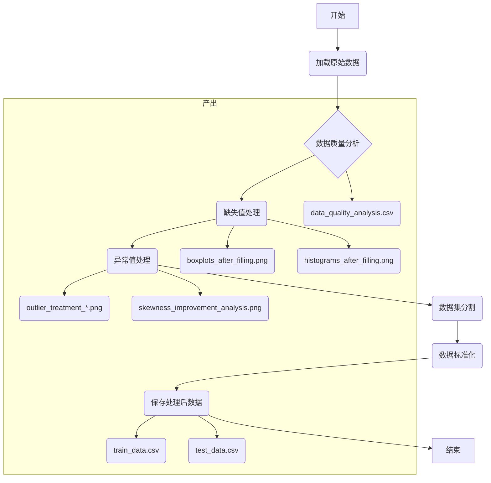
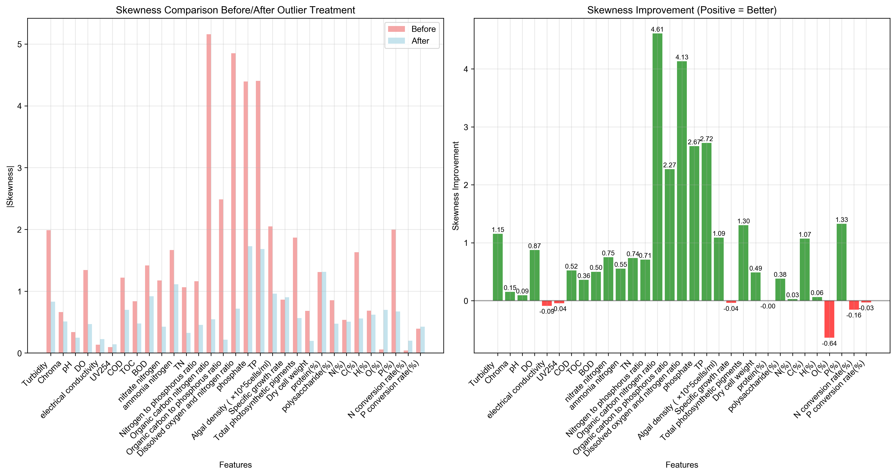

# 数据预处理详解

## 流程图

本文档详细阐述了 `src/data_processing/data_preprocessing.py` 脚本中实现的数据预处理流程。该流程旨在为后续的机器学习模型训练准备高质量、干净的数据。整个管道遵循了标准的机器学习最佳实践，包括数据质量分析、缺失值处理、异常值处理、数据标准化和防止数据泄露等关键步骤。

---

## 流程总览

数据预处理的完整流程在脚本的 `if __name__ == "__main__":` 主执行块中被精心编排。其核心步骤如下：

1.  **加载原始数据**: 从Excel文件中读取原始数据并进行初步清洗。
2.  **原始数据质量分析**: 对加载后的数据进行全面的健康检查，生成分析报告和可视化图表。
3.  **处理缺失值**: 采用针对性的策略（线性回归和KNN插补）填充缺失数据。
4.  **填充后分析**: 对填充后的数据再次进行可视化分析，以验证填充效果。
5.  **处理异常值**: 基于数据偏度，采用差异化的分层策略来处理异常值，并生成处理前后的对比图。
6.  **分割数据集**: 在标准化之前将数据分为训练集和测试集，以防止数据泄露。
7.  **数据标准化**: 采用 `RobustScaler` 对数据进行稳健的标准化处理。
8.  **保存处理后的数据**: 将处理完成的训练集、测试集和完整数据集保存为CSV文件。

下面，我们将按顺序详细拆解每一步的实现细节及其产出。

---

## 1. 加载原始数据

- **目标**: 从外部文件加载数据到Pandas DataFrame中，并进行初步的清洗。
- **实现函数**: `load_data()`
- **详细说明**: 
    - 使用 `pandas.read_excel` 读取位于 `data/raw/` 目录下的原始数据文件 `数据.xlsx`。
    - 在加载后，立即删除了 `S(%)`（硫含量）列。这通常是基于领域知识或初步分析，认为该特征与目标变量无关或数据质量过差，因此提前剔除。

---

## 2. 原始数据质量分析

- **目标**: 系统地评估原始数据集的质量，为后续的数据清洗和预处理提供决策依据。
- **实现函数**: `analyze_data_quality(data)`
- **详细说明**: 
    - **多维度分析**: 函数从缺失值、零值、偏度、峰度和数值范围等多个维度进行分析。
    - **控制台输出**: 在运行时，它会在控制台打印出结构化的分析报告，便于实时监控。
- **产出文件**:
    - `results/data_preprocess/raw_analysis/data_quality_analysis.csv`: 保存了每个特征的详细质量指标，包括缺失计数、缺失率、零值计数、零值率、偏度、峰度以及最大/最小/均值/标准差等。

---

## 3. 处理缺失值

- **目标**: 根据特征的相关性和数据特性，采用最合适的策略填充缺失值。
- **实现函数**: `handle_missing_values(data)`
- **详细说明**: 此函数没有采用单一的填充方法，而是实现了“具体问题具体分析”的策略：
    1.  **`phosphate` (磷酸盐) 缺失值处理**: 
        - 利用 `phosphate` 和 `TP` (总磷) 之间的强相关性，训练一个简单的**线性回归模型**来预测并填充 `phosphate` 的缺失值。这种方法比简单的均值或中位数填充更精确，因为它利用了特征间的内在关系。
    2.  **`N(%)` 和 `C(%)` 缺失值处理**: 
        - 对于剩余的缺失值，采用 **K-最近邻（KNN）插补** (`KNNImputer`)。KNN会寻找与缺失样本最相似的K个样本，并用这K个样本的加权平均值来填充缺失值，它同样利用了多维度特征间的关系，是一种比单变量填充更稳健的方法。

---

## 4. 填充后分析

- **目标**: 验证缺失值填充的效果，并为后续异常值处理提供数据基础。
- **实现函数**: `analyze_data_after_filling(data)`
- **详细说明**: 在填充缺失值后，脚本会进行一轮新的分析，以确保数据质量得到改善，并为后续步骤提供清晰的数据画像。
- **产出文件与可视化**:
    - **填充效果**: 通过填充后的箱线图和直方图，可以直观地评估插补效果。

      
      *图1: 缺失值填充后各特征的箱线图*

      
      *图2: 缺失值填充后各特征的直方图*

    - `results/data_preprocess/after_filling/skewness_kurtosis_analysis.csv`: 记录了填充后各数值特征的偏度和峰度值。
    - `results/data_preprocess/after_filling/scatter_plots_after_filling.png`: 特征与目标变量 `lipid(%)` 之间的散点图。

---

## 5. 处理异常值

- **目标**: 识别并处理数据中的异常值，以增强模型的稳定性和性能。
- **实现函数**: `handle_outliers(data, skewness_thresholds, treatment_strategies)`
- **详细说明**: 该项目采用了一种非常智能的、基于数据分布的**分层异常值处理策略**：
    - **诊断**: 首先根据填充后计算的**偏度**，将特征分为不同类别。
    - **分类处理**: 
        - **轻度偏斜**: 采用 **5%-95%分位数替换**（Winsorizing）。
        - **中度偏斜**: 采用更严格的 **10%-90%分位数替换**。
        - **严重偏斜**: 采用**对数变换 + 5%-95%分位数替换**的组合策略，从根本上改变数据分布形态，同时控制极端值。
- **闭环验证与可视化**:
    - **异常值处理效果**: 对比处理前后的数据分布，可以看出异常值被有效控制。

      .png)
      *图3: 严重偏斜特征异常值处理前后对比示例*

    - **偏度改善效果**: 对比处理前后的偏度值，特别是对于严重偏斜的特征，其偏度显著降低。

      
      *图4: 各特征异常值处理后偏度改善情况对比*

---

## 6. 分割数据集

- **目标**: 将数据集分为训练集和测试集，为后续的模型训练和评估做准备。
- **实现函数**: `split_dataset(data, test_size=0.2, random_state=42)`
- **详细说明**: 
    - 使用 `sklearn.model_selection.train_test_split` 函数进行分割。
    - `test_size=0.2` 表示将80%的数据用作训练，20%用作测试。
    - `random_state=42` 确保了每次分割的结果都是一致的，这对于实验的可复现性至关重要。
- **关键点**: 这一步在**数据标准化之前**执行，这是为了**防止数据泄露**。如果先标准化再分割，测试集的信息（如均值、方差）会“泄露”到训练集中，导致模型评估结果过于乐观，是不正确的做法。

---

## 7. 数据标准化

- **目标**: 对特征进行缩放，使其具有相似的尺度，同时对异常值不敏感。
- **实现函数**: `robust_scaling(data, scaler=None, fit=True)`
- **详细说明**: 
    - **方法**: 该函数使用 `sklearn.preprocessing.RobustScaler`。与 `StandardScaler`（使用均值和标准差）不同，`RobustScaler` 使用**中位数（median）**和**四分位距（IQR）**进行缩放。由于中位数和IQR对异常值不敏感，因此 `RobustScaler` 对于包含异常值的数据集是更稳健的选择。
    - **目标变量排除**: 目标变量 `lipid(%)` 在标准化过程中被排除，因为目标变量通常不应该进行标准化。
    - **防止数据泄露**: 
        - 在训练集上调用时，`fit=True`，`scaler` 会学习**训练集**的中位数和IQR，并转换训练集。
        - 在测试集上调用时，`fit=False`，`scaler` 会使用**之前从训练集学到的参数**来转换测试集，保证了处理的一致性。

---

## 8. 保存处理后的数据

- **目标**: 将最终处理好的数据持久化，供后续的模型训练和测试模块使用。
- **执行逻辑**: 脚本最终会将三个关键的DataFrame保存为CSV文件：
    - `train_data.csv`: 经过完整预处理的训练数据。
    - `test_data.csv`: 经过完整预处理的测试数据。
    - `processed_data.csv`: 合并后的完整预处理数据集，可用于交叉验证或最终模型训练。
- **存储位置**: 所有文件都保存在 `data/processed/` 目录下，结构清晰，便于后续模块调用。
